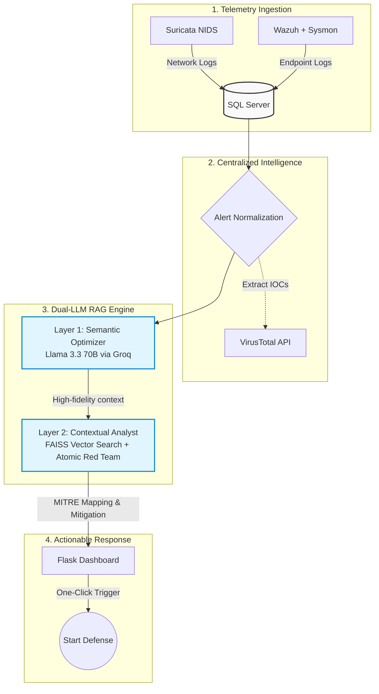

SOC Level-1 Automation: AI-Driven MITRE ATT&CK Mapping for Real-Time Threat Analysis,

The biggest bottleneck in a modern SOC is not a lack of data,
 but the time required to transform a raw alert into a technical and actionable response.
I’m excited to share our latest project: a Dual-LLM RAG Engine designed to operate as an AI-assisted Tier-1 SOC Analyst, automating alert enrichment and MITRE ATT&CK mapping with operational precision.

System Architecture:
The platform is built as a real-time, high-performance security pipeline:
Telemetry Ingestion
 Network and endpoint data collected from Suricata (NIDS) and Wazuh (HIDS), enriched with Sysmon for deep endpoint visibility.
Centralized Intelligence Layer
 All security events are normalized and stored in Microsoft SQL Server 2025 to enable fast retrieval and historical correlation.
Threat Enrichment
 Automated integration with VirusTotal to analyze and score suspicious IPs and IOCs in real time.

Dual-LLM RAG Engine:
Layer 1 – Semantic Optimizer
 Uses Llama 3.3 70B to clean noisy logs, extract high-fidelity IOCs, and infer attacker intent.
Layer 2 – Contextual Analyst
 Uses FAISS vector search with HuggingFace embeddings to retrieve precise attack context from the Atomic Red Team dataset (1,700+ validated attack tests).

Grounded SOC Synthesis:
 Alerts are mapped directly to MITRE ATT&CK techniques and tactics, with validated mitigation commands derived from real attack data, eliminating hallucinations.
Key Capabilities
Live Monitoring
 A custom Flask-based dashboard provides real-time visibility into security events.

Actionable Intelligence:
 Each alert includes a concise technical summary, MITRE mapping, and mitigation guidance.
Noise Reduction by Design
 The semantic rewriting layer filters false positives and focuses analysis on high-confidence threats.
One-Click Operation
 A single action triggers full analysis: alert enrichment, threat validation, and MITRE ATT&CK mapping, without manual intervention.

Technology Stack
Languages: Python (Flask)
AI / LLM: Llama 3.3 70B, LangChain, FAISS
SIEM & Monitoring: Wazuh, Suricata, Sysmon
Database: Microsoft SQL Server 2025
Threat Intelligence: MITRE ATT&CK(Atomic Red Team)
This project shifts AI in cybersecurity from conversational analysis to operational automation, enforcing validation against real-world adversary techniques and enabling faster, more reliable SOC decision-making.

Notes:
This project is designed to be fully scalable, allowing seamless integration with any SIEM platform, threat-intelligence API, or search engine through a modular architecture.
It supports a wide spectrum of attack techniques across all MITRE ATT&CK tactics, making it adaptable to diverse enterprise and SOC environments.
It is designed to easily integrate with any Large Language Model LLM (OpenAI, Ollama, etc.)


<div align="center">
  <h1>🛡️ SOC Level-1 Automation</h1>
  <h3>AI-Driven MITRE ATT&CK Mapping for Real-Time Threat Analysis</h3>
  <p>Automating alert enrichment, noise reduction, and threat mitigation using a Dual-LLM RAG Engine.</p>
</div>

---

## 📌 Project Overview

The biggest bottleneck in a modern Security Operations Center (SOC) is not a lack of data, but the time required to transform a raw alert into a technical and actionable response. 

This project introduces a **Dual-LLM RAG Engine** designed to operate as an AI-assisted Tier-1 SOC Analyst. It automates alert enrichment, filters false positives, and maps threats directly to the **MITRE ATT&CK** framework with operational precision, eliminating AI hallucinations and providing ready-to-use mitigation commands.

---

## 🏗️ System Architecture

The platform is built as a real-time, high-performance security pipeline. Below is the operational flow:



---

## ✨ Key Capabilities

> 🎯 **Noise Reduction by Design:** The semantic rewriting layer filters out false positives and strictly focuses analysis on high-confidence threats.

* **Live Monitoring:** A custom Flask-based dashboard provides real-time visibility into security events.
* **Grounded SOC Synthesis:** Alerts are mapped to MITRE ATT&CK techniques with validated mitigation commands derived from 1,700+ real attack tests.
* **One-Click Operation:** A single action triggers full analysis (enrichment, validation, and mapping) without manual intervention.

---

## 🛠️ Technology Stack

| Category | Technologies Used |
| :--- | :--- |
| **Languages & Frameworks** | Python, Flask, LangChain |
| **AI / LLMs** | Llama 3.3 70B (via Groq), FAISS (Vector DB), HuggingFace Embeddings |
| **SIEM & Telemetry** | Wazuh (HIDS), Suricata (NIDS), Sysmon |
| **Database** | Microsoft SQL Server |
| **Threat Intelligence** | VirusTotal, MITRE ATT&CK (Atomic Red Team Dataset) |

---

## 🚀 How to Run (Deployment Guide)

Follow these steps to deploy and activate the AI-Driven SOC pipeline:

### Step 1: Install Telemetry Tools
Ensure your network and endpoints are actively monitored:
* Install **Suricata** to capture network traffic.
* Deploy **Wazuh** (Manager & Agents) alongside **Sysmon** on endpoints.

### Step 2: Initialize the Database
* Open your database management tool.
* Import the provided database schema into your **Microsoft SQL Server**. This initializes the tables required for log ingestion and historical correlation.

### Step 3: Configure Environment Variables
Create a `.env` file in the root directory of your project. Add your API keys and database connection string as shown below:

```ini
# --- Dual-LLM Configuration ---
# Llama 3.3 70B via Groq API
GROQ_API_KEY=your_groq_api_key_here

# --- Database Configuration ---
# Ensure ODBC Driver 17 for SQL Server is installed
SQL_CONN_STR="DRIVER={ODBC Driver 17 for SQL Server};SERVER=localhost;DATABASE=SOC_AI;Trusted_Connection=yes;"

# --- Threat Intelligence ---
VIRUSTOTAL_API_KEY=your_virustotal_api_key_here
```
> ⚠️ **Security Warning:** Never commit your `.env` file containing real API keys to a public repository! Add `.env` to your `.gitignore` file.

### Step 4: Launch the Dashboard
Open your terminal, navigate to the project directory, and start the web interface:

```bash
python dashboard.py
```
*Access the dashboard via your web browser at `http://127.0.0.1:5000` (or the specific port shown in your terminal).*

### Step 5: Activate the AI Pipeline
1. Open the web dashboard.
2. Navigate to the **last tab** in the top navigation menu.
3. Click the **"Start Defense"** button.

> 🛡️ **Active Defense Engaged:** Clicking this button initiates the real-time pipeline, prompting the Dual-LLM Engine to instantly ingest logs, clean noise, and map threats to the MITRE ATT&CK framework.